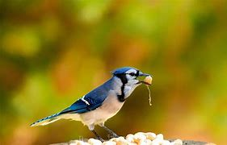
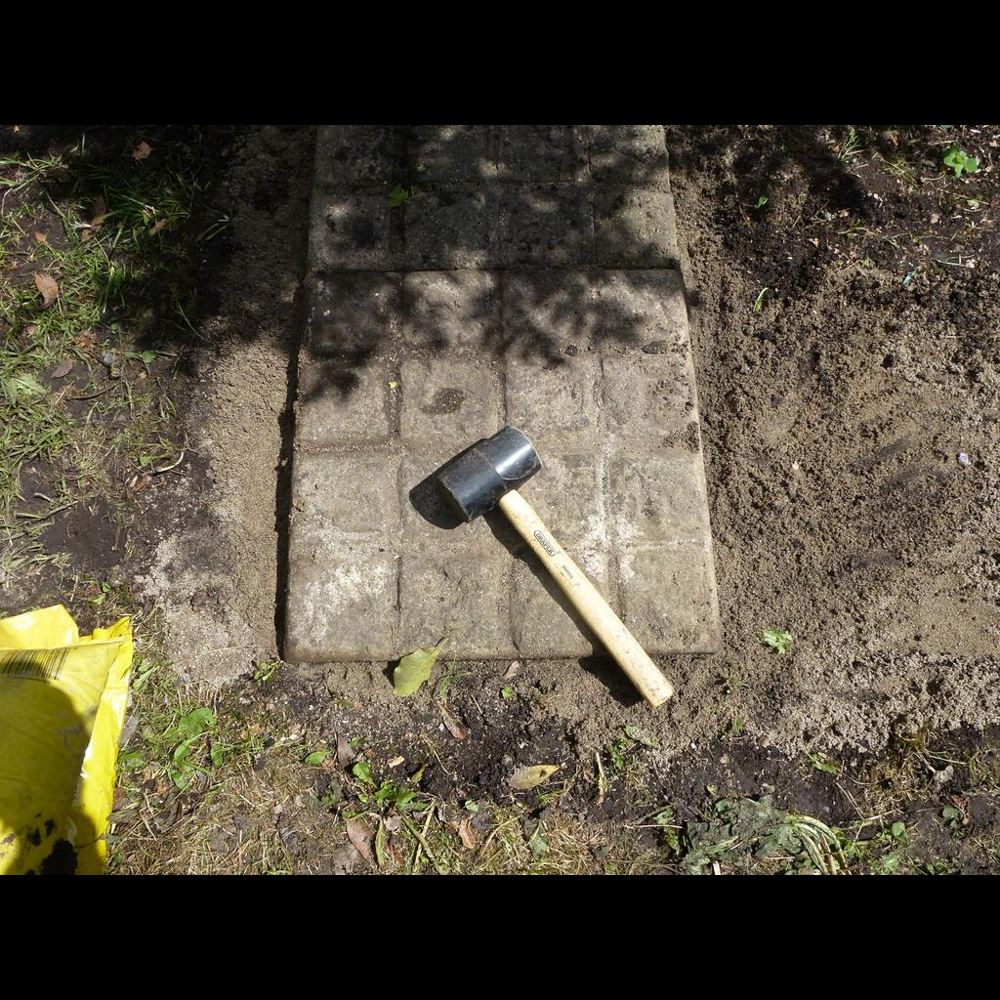

```{r setup,include=FALSE}
knitr::opts_chunk$set(echo = FALSE)
library(gridExtra)
load(file="presentation.Rdata")
```

## Data Requirements: {.smaller}

We have elected to perform analysis on an image file. In an effort to expedite and remove subjectivity we selected a random image of a blue jay:



The image considered in this project is read in as an array of R G B values (red, green, blue).

We have endeavor to investigate image analysis from a number of perspectives.  In this effort we have used many algorithms learned in this class, DS807.  Our overall goal was to determine which methods could be used for object detection.  Many of the methods fail for similar reasons, outlined below.

## Image Read into R as a plot: {.smaller}

This is the image after being read into R, and ploted using a scatter plot.

```{r}
p_0
```


## Part 1: Exploratory Data Analysis (EDA) {.smaller}

Purpose: Using the methods we have learned in this class, through trial and error, we will look at the usefulness of each for image analysis and classification.

`NA` was confirmed to be absent:
```{r echo=TRUE}
length(which(complete.cases(bluejay)))
dim(bluejay)[1]*dim(bluejay)[2]*dim(bluejay)[3]
```
There are three dependent variables `r,g,b` and two independent variables `x,y`. Scaling is unnecessary since the `rgb` values are all scaled `[0,1]`.

As can be seen above, the image is read in with each pixel defined.  This is verified since the number of cases is equal to the multiplied dimensionality: `y * x * n`. Where `x` is the x dimension of image array; `y` is the y dimension of the image, and `n` is the three color values: red, green, and blue [r,g,b].

## EDA comt. {.smaller}

Distributions of Red, Green, and Blue pixel intensities shown below:
```{r}
grid.arrange(p_1,p_2,p_3,nrow=1)
```

Based on the distributions, it appears reasonable to estimate these as mixtures of normal distributions (see section 3 Mixture Models).

## EDA cont. {.smaller}

As investigation, since we are looking at an image of a blue jay it may be of value to look only at the blue hue (isolation performed by zeroing `r.value`, and `g.value`)

This is potentially trivial however the image is displayed for visual assessment.

```{r}
p_4
```

## EDA cont. {.smaller}
A cubic Model was developed to locate the highest density of blue coloration. The maximum is indicated with a red dot:
```{r}
lmxyb$call
```

```{r}
p_5
```

If it is known beforehand that the location of highest blue is likely where the blue jay is located, this may be a simple way to find blue jays in an image.  However, this assumes that the background is not saturated in blue (if the image is of the bird flying for example).

## EDA cont. {.smaller}
Smoothing Spline:

```{r}
gam_red$call
gam_green$call
gam_blue$call
```

## EDA cont. {.smaller}
Next a smoothing spline is used to approximate the color distribution in the image:

```{r}
p_6
```

## EDA cont. {.smaller}
The location at which the image color intensities are farthest away (Manhattan distance) are indicated using black:

```{r eval=FALSE, echo=TRUE, wrap=TRUE}
eps <- 0.2
rgbImage$r.value_ss_gone <- ifelse((abs(rgbImage[3] - rgbImage[6])>eps) |
                                       (abs(rgbImage[4] - rgbImage[7])>eps) | 
                                       (abs(rgbImage[5] - rgbImage[8])>eps),
                                   0,rgbImage$r.value_ss)
rgbImage$g.value_ss_gone <- ifelse((abs(rgbImage[3] - rgbImage[6])>eps) | 
                                       (abs(rgbImage[4] - rgbImage[7])>eps) | 
                                       (abs(rgbImage[5] - rgbImage[8])>eps)
                                   ,0,rgbImage$g.value_ss)
rgbImage$b.value_ss_gone <- ifelse((abs(rgbImage[3] - rgbImage[6])>eps) | 
                                       (abs(rgbImage[4] - rgbImage[7])>eps) | 
                                       (abs(rgbImage[5] - rgbImage[8])>eps)
                                   ,0,rgbImage$b.value_ss)
```


## EDA cont. {.smaller}
Smoothing Spline: $\epsilon$ = 0.2

One can see that this does a relatively poor job of identifying the location of the bird.  

```{r}
p_7
```

## EDA cont. {.smaller}
Smoothing Spline: $\epsilon$ = 0.3

The distance measure was extended.  If one is interested in object or edge detection, this method (dependant on an appropriately tuned $\epsilon$) appears to locate where an object of interest may exist - in this case the blue jay.

```{r}
p_8
```

## EDA cont. {.smaller}
Smoothing Spline: $\epsilon$ = 0.4

Continuing to extent the distance criteria appears to fail to identify edges on interest.  Therefore if one where using this technique it is imperative to tune $\epsilon$ for every image individually.

```{r}
p_9
```

## Part 2: Clustering K-Means {.smaller}

Clustering can be used to analyze the number of potentially distinct colors - though clustering fails to perform image and object identification. 

Based on the gap statistic, the optimal number of clusters for K-means is `1`. This affectively flattens the entire image into a signle brown color.

```{r}
p_10
```

## Clustering K-Means cont. {.smaller}

Further example of how clustering is not capable of object identification.  Even using `k=2` yields only a representation of the image with two hues, this does not take into account location interactions.

```{r}
p_11
```

## Clustering DBSCAN {.smaller}

DBSCAN with initial logarithmic search:

```{r eval=FALSE, echo=TRUE}
eps = 10^c(-5:5)
minPts = 2^c(1:7)
```
eps = `r c_db$eps` ; minPts = `r c_db$minPts`

One can see that this may be useful in object detection, but not in object identification.  The highest number of un-clustered pixels (displayed in black) could be used to identify possibly unique colors. The average x and y values of unclustered pixels were averaged, and indicated with a red dot.

```{r}
grid.arrange(p_12,p_12.1,nrow=1)
```

## Clustering DBSCAN {.smaller}

```{r eval=FALSE, echo=TRUE}
eps = c(0.005,0.01,0.02,0.04,0.08)
minPts = c(3,4,5,6,7)
```
eps = `r c_db1$eps` ; minPts = `r c_db1$minPts`

It appears that further parameter search (based narrowed ranges) also continues to identify a potential object.

```{r}
grid.arrange(p_13,p_13.1,nrow=1)
```

## Part 3: Mixture Models {.smaller}

Used stepFlexmix to determine optimal number of Gaussian distributions. Optimized based on BIC.

```{r}
p_14
```

## Mixture cont.

Resulting **red** color mixture model - 6 normal distributions:

```{r}
grid.arrange(p_15,p_15.1,nrow=1)
```

## Mixture cont.

Resulting **green** color mixture model - 6 normal distributions:

```{r}
grid.arrange(p_16,p_16.1,nrow=1)
```

## Mixture cont.

Resulting **blue** color mixture model - 6 normal distributions:

```{r}
grid.arrange(p_17,p_17.1,nrow=1)
```

## Part 4: Deep Learning {.smaller}
```{r}
nn.model
```

## Train Set: {.smaller}
For image comparison we downloaded all blue jay and hammer images from OpenImages https://storage.googleapis.com/openimages/web/download.html

{width=20%}
{width=20%}
{width=20%}
{width=20%}

... etc. total of 93 images. 40 blue jays. 53 hammers.

## Deep Learning cont. {.smaller}
```{r}
p_hist
```

## Deep Learning cont. {.smaller}
Test Set, Blue Jays:

{width=15%}
.jfif){width=15%}
.jfif){width=15%}
.jfif){width=15%}
.jfif){width=15%}

Test Set, Hammers:

{width=15%}
.jfif){width=15%}

## Deep Learning cont. {.smaller}
Prediction vector:
```{r}
pred.nn
```

`hammer = 0`

`bluejay = 1`

... all hammers (?)

## Deep Learning cont. {.smaller}
<iframe src="./compare-runs-2021-05-09T17-50-08Z-2021-05-09T17-39-16Z.html"></iframe>


## Deep Learning cont. {.smaller}
Model parameter, and results considerations:

* Dense Layers - More and Fewer
* Dense Layer Nodes - More and Fewer
* Loss Functions - Poisson, Categorical Crossentropy
* CNN Layers - More
* CNN Kernels - Larger
* CNN Filters - More
* Additional training data
* Number of Epochs - More
* Validation split - increased

None of this tuning had an impact on the output


## Part 5: Conclusion {.smaller}

Conclusion based on purpose: 

* GAM with smoothing spline on x and y axes, incorporating a difference criteria, can detect potential objects of interest. This is image specific analysis and requires oversight by the analyst to tune appropriately.

* DBScan can be used to discriminate on the presence or absence of an object compared to the background.

* K-Means and Mixture can assist in color complexity reduction but fail to detect or identify objects.

* Deep learning techniques are the only viable set of algorithms for object identification.

Analysis Improvement: 

  * Our neural net did not have a sufficiently large training set to solve our targeted problem.

## Part 5: Conclusion cont. {.smaller}
    
Learning Outcomes:

* Classical models may be used to select features from an image, provided that the contents are already known.

* When used in conjunction with proper image preprocessing, basic object detection can be achieved with DBScan.

* Keras/Tensorflow is not ideal for object detection when the train set is small.

  * We observed that it appeared to memorize all of the training images, and thus perfectly predict them during training, but it would not extrapolate onto the new data.

* Other techniques such as OpenCV or evolutionary neural nets may have been able to achieve better results with the data we had.