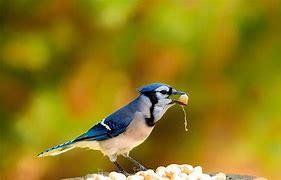
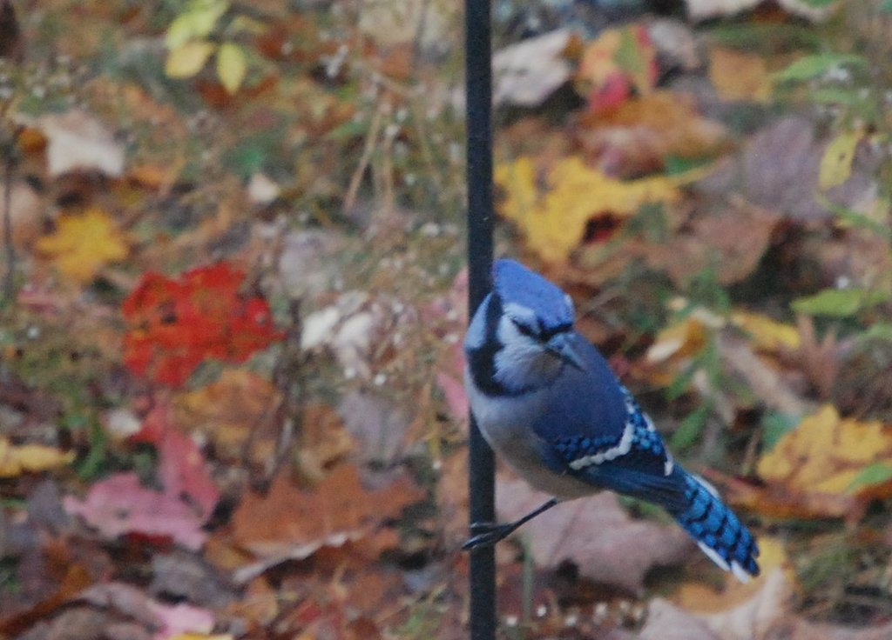
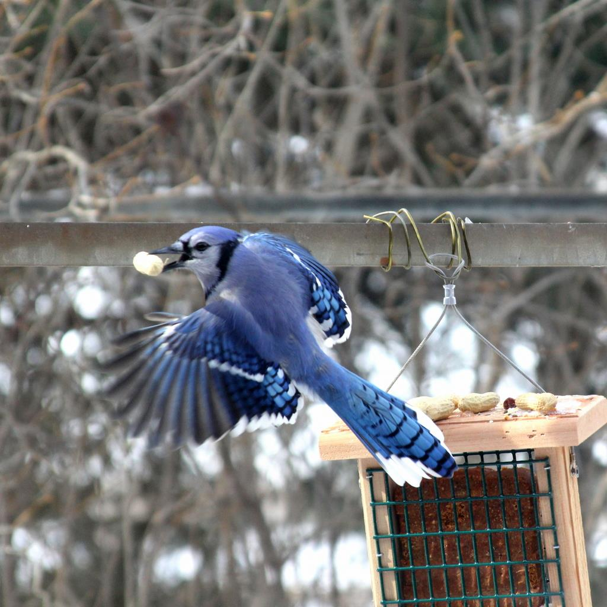
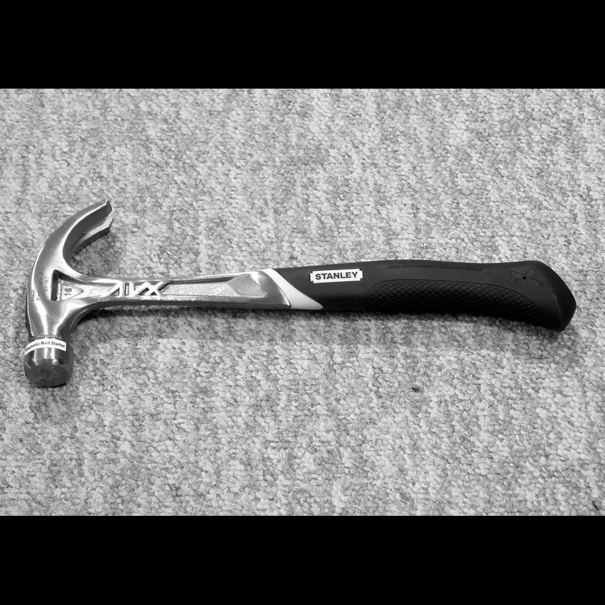
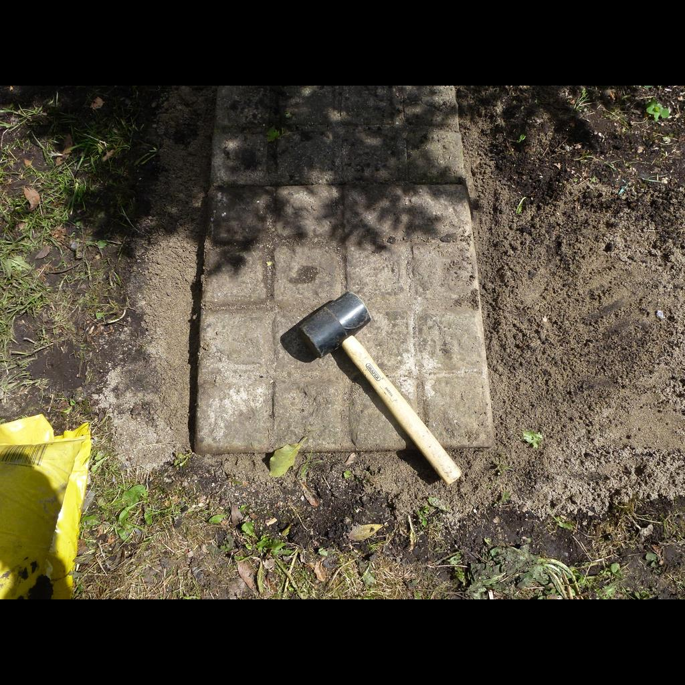

```{r setup,include=FALSE}
knitr::opts_chunk$set(echo = FALSE)
library(gridExtra)
load(file="presentation.Rdata")
```



## Data Requirements: {.smaller}

We have elected to perform analysis on an image file:

- Text Data

- Image Data*

- Unsupervised Data

In an effort to expedite and remove subjectivity we selected a random image of a blue jay:


## Image Read into R as a plot: {.smaller}

```{r}
p_0
```

## Image Comparison - more to follow: {.smaller}
{width=5%}

For image comparison we downloaded all blue jay and hammer images from OpenImages https://storage.googleapis.com/openimages/web/download.html

{width=20%}
{width=20%}
{width=20%}
{width=20%}

... etc. total of 93 images. 40 blue jays. 53 hammers.

## Part 1: Exploratory Data Analysis (EDA) {.smaller}

Purpose: Using the methods we have learned in this class, through trial and error, we will look at the usefulness of each for image analysis and classification.

`NA` was confirmed to be absent:
```{r echo=TRUE}
length(which(complete.cases(bluejay)))
dim(bluejay)[1]*dim(bluejay)[2]*dim(bluejay)[3]
```
There are three dependent variables `r,g,b` and two independent variables `x,y`. Scaling is unnecessary since the `rgb` values are all scaled `[0,1]`.

As can be seen above, the image is read in with each pixel defined.  This is verified since the number of cases is equal to the multiplied dimensionality: `y * x * n`. Where `x` is the x dimension of image array; `y` is the y dimension of the image, and `n` is the three color values: red, green, and blue [r,g,b].

## EDA comt. {.smaller}

Distributions of Red, Green, and Blue pixel intensities:
```{r}
grid.arrange(p_1,p_2,p_3,nrow=1)
```

As investigation, since we are looking at an image of a blue jay it may be of value to look only at the blue hue (isolation performed by zeroing `r.value`, and `g.value`)

## EDA cont. {.smaller}

Potentially trivial we look at the image - filtered all red and green color for baseline comparison.

```{r}
p_4
```

## EDA cont. {.smaller}
Cubic Model (blue only):
```{r}
lmxyb$call
```

```{r}
p_5
```

## EDA cont. {.smaller}
Smoothing Spline:

```{r}
gam_red$call
gam_green$call
gam_blue$call
```

## EDA cont. {.smaller}
Smoothing Spline:

```{r}
p_6
```

## EDA cont. {.smaller}
Smoothing Spline:

```{r eval=FALSE, echo=TRUE, wrap=TRUE}
eps <- 0.2
rgbImage$r.value_ss_gone <- ifelse((abs(rgbImage[3] - rgbImage[6])>eps) |
                                       (abs(rgbImage[4] - rgbImage[7])>eps) | 
                                       (abs(rgbImage[5] - rgbImage[8])>eps),
                                   0,rgbImage$r.value_ss)
rgbImage$g.value_ss_gone <- ifelse((abs(rgbImage[3] - rgbImage[6])>eps) | 
                                       (abs(rgbImage[4] - rgbImage[7])>eps) | 
                                       (abs(rgbImage[5] - rgbImage[8])>eps)
                                   ,0,rgbImage$g.value_ss)
rgbImage$b.value_ss_gone <- ifelse((abs(rgbImage[3] - rgbImage[6])>eps) | 
                                       (abs(rgbImage[4] - rgbImage[7])>eps) | 
                                       (abs(rgbImage[5] - rgbImage[8])>eps)
                                   ,0,rgbImage$b.value_ss)
```


## EDA cont. {.smaller}
Smoothing Spline: $\epsilon$ = 0.2

```{r}
p_7
```

## EDA cont. {.smaller}
Smoothing Spline: $\epsilon$ = 0.3

```{r}
p_8
```

## EDA cont. {.smaller}
Smoothing Spline: $\epsilon$ = 0.4

```{r}
p_9
```

## Part 2: Clustering K-Means {.smaller}

Clustering can be used to analyze the number of potneitally distinct colors - though clustering fails to perform image and object identification. 

Based on the gap statistic, the optimal number of clusters for K-means is `1`.

```{r}
p_10
```

## Clustering K-Means cont. {.smaller}

Further example of how clustering is not capable of object identification.

```{r}
p_11
```

## Clustering DBSCAN {.smaller}

DBSCAN with initial logarithmic search:

```{r eval=FALSE, echo=TRUE}
eps = 10^c(-5:5)
minPts = 2^c(1:7)
```
eps = `r c_db$eps` ; minPts = `r c_db$minPts`

```{r}
p_12
```

## Clustering DBSCAN {.smaller}

```{r eval=FALSE, echo=TRUE}
eps = c(0.005,0.01,0.02,0.04,0.08)
minPts = c(3,4,5,6,7)
```

eps = `r c_db1$eps` ; minPts = `r c_db1$minPts`
```{r}
p_13
```

## Part 3: Mixture Models {.smaller}

Used stepFlexmix to determine optimal number of Gaussian distributions. Optimized based on BIC.

...

1. Apply a mixture model based clustering to your data.

2. Explain your choices on model parameters, and communicate your results.


## Part 4: Deep Learning (20 points)

1. Apply a type of neural network algorithm to your data.

2. Explain your choices on model parameters, and communicate your results.


## Part 5: Conclusion (20 points)

1. (10 points) Based on the purpose of your analysis stated in Part 1, which analysis did a good/better/satisfactory job? How do you think you can improve the analysis?

    
2. (10 points) What are your learning outcomes for this assignment? Please focus on your learning outcomes in terms of analysis, model interpretations, and R skills - it is up to you to include this part in your presentation or not.


- **Decision/why?**: Explain your reasoning behind your choice of the procedure, set of variables and such for the question. 

    - Explain why you use the procedure/model/variables
    - To exceed this criterion, describe steps taken to implement the procedure in a non technical way.


- **Communication of your findings**: Explain your results.

    - Explain why you think one model is better than the other.
    - To exceed this criterion, explain your model in a non technical way.

